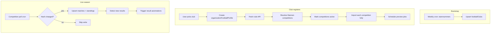
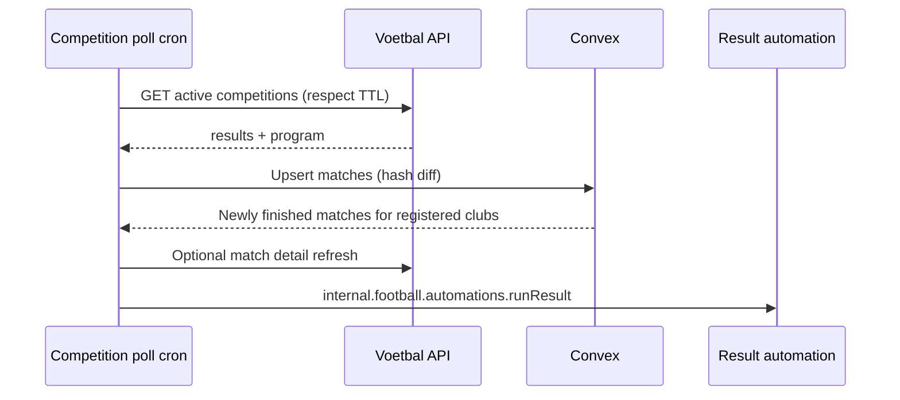

# Voetbal data integration — research & recommendations

Branch: `voetbal-data-research` · Date: 2026-06-15

This document captures research for integrating [Voetbal in België](https://www.voetbalinbelgie.be) data into Matchscore: API shape, Convex schema, sync strategy, automation triggers, and what to store for registered vs unregistered clubs.

Related artifacts:

- [voetbalinbelgie-api-reference.md](./voetbalinbelgie-api-reference.md) — probed endpoint catalog (re-run `pnpm probe:voetbal-api` for live JSON)
- [../automations-and-templates.md](../automations-and-templates.md) — existing automation/template model
- [../../plans/voetbal-data-implementation-plan.md](../../plans/voetbal-data-implementation-plan.md) — phased implementation plan

---

## 0. Product context (homepage & current app)

Matchscore is automated social media for **Belgian amateur football clubs**:

1. Club selects itself → calendar imported from federation data (Voetbal in België).
2. Club designs templates for match **preview** (~2 days before kickoff) and **result** (after final score).
3. Automations publish to Facebook/Instagram when enabled.

**Already built:** organizations, automation toggles, Konva templates, server render pipeline, mock match bindings (`homeClubName`, `awayClubName`, `matchDateTime`, `matchAddress`, `score`, logos).

**Not built yet:** real football data, scheduling/posting pipeline, social OAuth.

**MVP scope from API provider:** first teams only (no youth/reserve tiers in Voetbal in België data).

---

## 1. API shape & documentation

### 1.1 Base URLs & auth

| Item | Value |
| --- | --- |
| API base | `https://api.voetbalinbelgie.be` |
| Auth header | `X-Api-Key: <key>` |
| Response format | JSON |
| Path rule | Same path as public website, on `api.` subdomain |

**URL quirks discovered during probing:**

- **Competition** endpoints work directly on `api.voetbalinbelgie.be` (redirect to `index.php` only when needed).
- **Stamnummers, club, match** endpoints on `api.` often 301 to HTML pages; use `https://www.voetbalinbelgie.be/index.php?sFormat=API&sUrl=<path>` as fallback (probe script handles this).

Store `VOETBALINBELGIE_API_KEY` in Convex env (already done on your dev deployment). Never expose to the client.

### 1.2 Endpoints Matchscore needs

| Endpoint | Example | Primary use |
| --- | --- | --- |
| Stamnummers | `/stamnummers/` | Global club directory for search/onboarding |
| Competition | `/competities/2025-2026/antwerpen/mannen/2a/` | Standings, program, results — **bulk sync & score polling** |
| Club | `/clubs/a/aartselaar-ksv/` | Discover which competitions a club plays in after registration |
| Match | `/wedstrijd/724391/20-09-2025-brasschaat-kfc-aartselaar-ksv/` | Venue/address confirmation before posting |

### 1.3 Competition payload (canonical)

See [voetbalinbelgie-api-reference.md](./voetbalinbelgie-api-reference.md) for the official PDF example.

**Key fields for Matchscore:**

| Area | Fields | Notes |
| --- | --- | --- |
| Meta | `id`, `title`, `district`, `season` | Stable competition identity |
| Links | `related[]` with `name`, `shirt`, `href` | Club directory enrichment |
| Standings | `leaguetable`, `period1..3` | Store if needed later; not required for MVP posting |
| Fixtures | `program[]` | `status`, `date`, teams, empty scores |
| Results | `results[]` | Same row shape; filled scores |

**Match row shape (program + results):**

```typescript
{
  status: string;       // "Nog te spelen/Open" | "Uitgespeeld" | ...
  date: string;         // "2025-09-20 19:30:00" (Europe/Brussels)
  home: string;         // Display name (may include " B" suffix)
  away: string;
  homeGoals: number;
  awayGoals: number;
  result: string;       // "1 - 6" or ""
}
```

**Gap:** Competition rows do not include match id in the PDF example. The website adds numeric ids in match URLs (`724391`). Expect club/match endpoints OR HTML-derived ids — implementation must parse match links when present in live API responses (verify after `pnpm probe:voetbal-api`).

### 1.4 Caching & polling budget

Official TTL schedule:

| When | TTL |
| --- | --- |
| Mon–Fri | 4 hours |
| Sat–Sun before 15:00 | 1 hour |
| Sat–Sun after 15:00 | 15 minutes |

**Recommendation:** Poll **active competitions** at most once per TTL window. Track `nextPollAfter` per competition in Convex. On match days (Sat/Sun), tighten polling after 15:00 only for competitions that have a registered club playing that day.

### 1.5 Data quality expectations

- Manually maintained by volunteers; occasional errors.
- No direct KBVB live feed; results appear minutes to hours after matches.
- Automations should **re-fetch before posting** and tolerate last-minute corrections.

---

## 2. Convex database schema & sync

### 2.1 Design principles

1. **Competition-scoped match storage** — one row per match per competition; avoids duplicates when Club B registers after Club A.
2. **Lightweight global club directory** — stamnummers only until a club registers.
3. **Activate competitions, not clubs, for heavy sync** — if any customer club plays in a competition, sync the full competition.
4. **Store source payloads** — keep normalized fields plus `rawSnapshot` / hash for change detection.
5. **Minimal table count** — five football tables + reuse existing `organizations`.

### 2.2 Recommended tables

#### `footballClubs` (global directory)

Populated from **stamnummers** endpoint only (nightly or weekly job).

| Field | Type | Notes |
| --- | --- | --- |
| `stamnummer` | string | Unique federation id |
| `displayName` | string | Search label |
| `slugPath` | string | e.g. `clubs/a/aartselaar-ksv/` |
| `apiPath` | string | Same as slugPath |
| `searchText` | string | Normalized for typeahead |
| `shirtAsset` | optional string | `t_48.png` style |
| `logoUrl` | optional string | Derived CDN URL when known |
| `updatedAt` | number | |

Indexes: `by_stamnummer`, `by_searchText` (or Convex search index).

**Do not store:** standings, matches, addresses until needed.

#### `footballCompetitions`

Created when first registered club needs them; also referenced by matches.

| Field | Type |
| --- | --- |
| `apiPath` | string (unique) |
| `externalId` | optional number (meta.id) |
| `season`, `district`, `title` | strings |
| `syncTier` | `"active"` \| `"dormant"` |
| `lastSyncedAt`, `nextPollAfter` | numbers |
| `lastPayloadHash` | string |
| `rawMeta` | optional object |

`syncTier = active` when ≥1 registered org has a team in this competition.

#### `footballMatches`

Normalized match rows from competition `program` + `results`, enriched from match endpoint when needed.

| Field | Type |
| --- | --- |
| `externalMatchId` | optional string | From wedstrijd URL when known |
| `competitionId` | Id |
| `homeClubId`, `awayClubId` | Id (nullable until resolved) |
| `homeName`, `awayName` | string | Raw API labels |
| `kickoffAt` | number | UTC ms |
| `status` | union literal |
| `homeGoals`, `awayGoals` | optional numbers |
| `resultText` | optional string |
| `venueName`, `venueAddress` | optional strings |
| `apiPath` | optional string |
| `contentHash` | string | Change detection |
| `previewScheduledAt` | optional number |
| `resultPostedAt` | optional number |

Indexes:

- `by_competition_and_kickoff`
- `by_externalMatchId` (unique when present)
- `by_competition_and_status`

**Dedup rule:** Upsert by `(competitionId, externalMatchId)` if id known, else `(competitionId, kickoffAt, homeName, awayName)`.

#### `footballStandings` (optional for MVP)

One row per club per competition snapshot — only if UI needs tables later. Can defer and read from last competition payload cache.

#### `organizationFootballProfile`

Links a Matchscore org to federation data.

| Field | Type |
| --- | --- |
| `organizationId` | Id (unique) |
| `footballClubId` | Id |
| `stamnummer` | string |
| `primaryTeam` | `"mannen"` (MVP constant) |
| `activatedAt` | number |
| `competitionIds` | array of Id | Mannen competitions this season |

#### `footballSyncJobs` (operational)

| Field | Type |
| --- | --- |
| `kind` | `"stamnummers"` \| `"competition"` \| `"club"` |
| `targetPath` | string |
| `status` | `"pending"` \| `"running"` \| `"failed"` \| `"done"` |
| `scheduledAt`, `completedAt` | numbers |
| `error` | optional string |

### 2.3 Sync flows



### 2.4 Change detection & updates

1. Fetch competition JSON.
2. Hash normalized `results + program` (or full payload).
3. If hash differs:
   - Upsert matches (patch changed rows only).
   - For kickoff changes: **reschedule** preview `runAt` jobs.
   - For new `Uitgespeeld` rows: enqueue result automation.

### 2.5 Solving the Club A / Club B duplicate match problem

**Recommended approach: competition-level activation (import per competition).**

| Scenario | Behavior |
| --- | --- |
| Club A registers in competition X | Competition X becomes `active`; import **all** matches in X |
| Club B registers later, also in X | Competition X already active; B links to existing match rows |
| Club B in new competition Y | Activate Y; import all of Y (includes opponents not registered) |
| Unregistered opponent data | Stored only as part of an **active** competition, not via club endpoint |

**Why not club-only import?** Club endpoint returns overlapping match lists; you'd duplicate matches and struggle to reconcile scores. Competition endpoint is the authoritative scoreboard for polling.

**Trade-off:** You store matches for unregistered clubs in active competitions. That is acceptable because:

- Volume is bounded per competition (~15–20 teams × ~30 matches).
- You need opponent names/logos for templates anyway.
- You avoid N×club API calls on match day.

**What you do not store:** Competitions with zero registered clubs (dormant tier).

### 2.6 Name resolution (club matching)

Competition rows use **display names** (`KSV Aartselaar`, `KFC Putte`), not stamnummers.

Resolution pipeline:

1. Parse `links.related[]` from competition payload → map `name` → `href` → `footballClubs` slug.
2. Fallback fuzzy match on `footballClubs.displayName`.
3. If unresolved, create placeholder club row with `stamnummer: null` and `displayName` only — link when stamnummers/club data fills in.

---

## 3. Automation triggering

### 3.1 Match preview (`match_announcement`) — 2 days before

**Recommended: per-match scheduled functions + daily reconciliation cron.**

| Mechanism | Role |
| --- | --- |
| `ctx.scheduler.runAt(previewAt, internal.football.automations.runPreview, …)` | Primary trigger at exact time |
| Daily cron (~06:00 Europe/Brussels) | Safety net: find matches in 47–49h without scheduled job |

**Preview time:** `kickoffAt - 48 hours`, snapped to **10:00 local** (configurable per org later). If kickoff is Monday 20:00, preview posts Saturday 10:00.

**On schedule / reschedule:**

1. Re-fetch competition (or match) endpoint — confirm kickoff, opponent, venue.
2. If match cancelled/postponed → skip or reschedule.
3. Pick random enabled template (future helper).
4. Render + post (future pipeline).

**Why not cron-only?** A daily cron scanning all matches works but fires imprecisely and re-scans the whole table. `runAt` is cheaper and more accurate; keep cron as backup.

### 3.2 Match result (`match_result`) — when score available

**Recommended: competition polling → diff → event-driven automation.**



**Polling strategy:**

- Maintain `activeCompetitions` list (union of competitions for registered orgs).
- One API call per active competition per TTL window — **not** one call per club.
- After 15:00 on Sat/Sun, poll active competitions with a match that day every 15 minutes.
- Weekdays: 4-hour interval unless a registered club has a match within 3 hours (optional boost to 1 hour).

**Trigger condition:**

- `status` transitions to finished (`Uitgespeeld` or equivalent).
- `homeGoals`/`awayGoals` present.
- Match involves registered club's `primaryTeam` (name suffix rules).
- Idempotency: `resultPostedAt` null on `organizationFootballProfile` × match automation record.

**Pre-post refresh:** Always re-fetch competition (or match) immediately before render — scores can be corrected.

### 3.3 Multi-club customers

Each `organization` has its own:

- `organizationAutomations` (already exists)
- `organizationFootballProfile`
- Automation idempotency records (new table `footballAutomationRuns`)

When competition poll detects a finished match:

- Find all registered orgs where `footballClubId` is home or away **and** `match_announcement`/`match_result` enabled.
- Run separate automation per org (different templates/social accounts).

Same match row → multiple automation runs. Store per-org run state.

### 3.4 Idempotency table (recommended)

`footballAutomationRuns`:

| Field | Type |
| --- | --- |
| `organizationId` | Id |
| `matchId` | Id |
| `automationType` | `match_announcement` \| `match_result` |
| `status` | `scheduled` \| `running` \| `posted` \| `skipped` \| `failed` |
| `scheduledFunctionId` | optional Id |
| `postedAt` | optional number |
| `error` | optional string |

Unique index on `(organizationId, matchId, automationType)`.

---

## 4. What data to store, and when

| Data | When stored | Scope |
| --- | --- | --- |
| Stamnummers club list | Bootstrap cron (weekly) + manual refresh | All Belgian clubs (~directory only) |
| Club address, logo, phone | On registration (club endpoint) + lazy match refresh | Registered club + opponents in active competitions |
| Competitions | When first registered club needs them | Only competitions with ≥1 registered team |
| Full competition standings | Same as competition import | Active competitions only |
| All matches in competition | Competition import / poll | Active competitions only |
| Match venue detail | Lazy fetch match endpoint before preview/result | Matches involving registered clubs |
| Automation schedules | After match import or kickoff change | Registered clubs only |
| Historical seasons | Not by default | On-demand if product adds archive |

### 4.1 Registration flow (data perspective)

1. User searches `footballClubs` (stamnummers index).
2. `createOrganization` + `organizationFootballProfile` linking `stamnummer`.
3. Internal action `activateClubFootballData`:
   - Fetch club API → list Mannen competitions for current season.
   - For each competition: set `syncTier=active`, full import.
   - Schedule preview jobs for fixtures in next 60 days.
4. UI shows imported calendar (query matches by `organizationFootballProfile.competitionIds` + club id).

### 4.2 Second club registers in same competition

- Competition already active → skip full re-import unless `lastSyncedAt` stale.
- Link org to existing `footballMatches` rows.
- Schedule preview/result automations for **their** upcoming matches only.
- No duplicate match rows.

### 4.3 Club registers in new competition

- New competition activated → import all teams/matches.
- Overlap with existing active competition: matches dedupe by external id / composite key.

### 4.4 Club never registers

- Only stamnummers directory row exists.
- No competition/match data fetched.

---

## 5. Summary recommendations

| Topic | Recommendation |
| --- | --- |
| API access | Convex actions with `VOETBALINBELGIE_API_KEY`; probe script for docs |
| Primary sync unit | **Competition**, not club |
| Global data | Stamnummers → `footballClubs` only |
| Duplicate matches | Competition-level storage + stable match ids |
| Preview trigger | `scheduler.runAt(kickoff - 48h)` + daily reconciliation cron |
| Result trigger | Poll active competitions (TTL-aware) + diff finished matches |
| Before posting | Re-fetch match/competition data |
| Multi-tenant | Shared match rows; per-org `footballAutomationRuns` |
| MVP team scope | Mannen (first team) only |

---

## 6. Open questions to validate with live API

Run `pnpm probe:voetbal-api` and confirm:

1. Do `program`/`results` rows include match ids or wedstrijd URLs?
2. Exact `club` and `match` JSON top-level keys (likely `club`, `match` wrappers).
3. Stamnummers JSON structure (array vs `{ clubs: [] }`).
4. Whether `links.related` names exactly match row `home`/`away` strings.

Update [voetbalinbelgie-api-reference.md](./voetbalinbelgie-api-reference.md) after probing.
