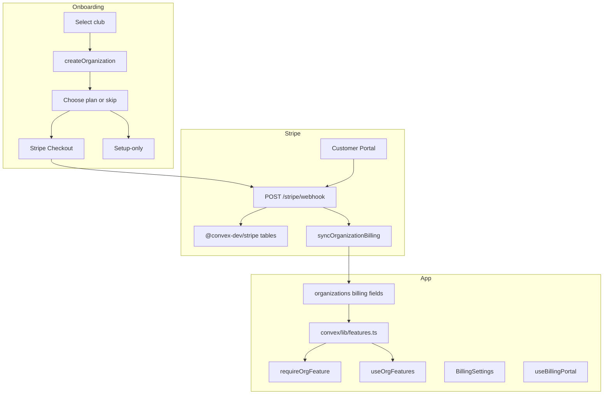

# Stripe billing

Matchscore uses [@convex-dev/stripe](https://www.convex.dev/components/stripe) for org-scoped club subscriptions. Billing is tied to the **organisation** (not individual users): any org member can view billing in Settings and open the Stripe Customer Portal.

## Plans and pricing

| Tier | Billing | Price (excl. VAT) | Goal highlights |
| ---- | ------- | ----------------- | --------------- |
| **none** | — | Free (setup-only) | No |
| **Minimum** | Annual subscription | €24/year | No |
| **Pro** | Annual subscription | €108/year | No |
| **Elite** | Annual subscription | €144/year | Yes |
| **Lifetime** | One-time payment | €250 | Yes |

Price IDs and Belgian VAT tax rate IDs live in `convex/billing/stripeCatalog.ts`. Test vs live catalog is selected automatically from the Stripe secret key prefix (`sk_test_` → test, `sk_live_` → live).

Belgian checkout applies the catalog `beVat` tax rate when the user selects **BE** as billing country; other countries get no tax rate on the Checkout session.

## Architecture



**Source of truth:** Stripe holds subscriptions and payments. The `organizations` document stores a **denormalized cache** (`plan`, `subscriptionStatus`, `subscriptionCancelAtPeriodEnd`, etc.) updated by webhooks and occasional Stripe API sync. Feature gating reads the org cache — not live Stripe API calls.

## Organisation billing fields

On `organizations` (`convex/schema.ts`):

| Field | Purpose |
| ----- | ------- |
| `plan` | `none` \| `minimum` \| `pro` \| `elite` \| `lifetime` |
| `subscriptionStatus` | `active` \| `past_due` \| `canceled` \| `none` |
| `subscriptionCancelAtPeriodEnd` | `true` when user scheduled cancellation but period not ended |
| `stripeCustomerId` | Stripe customer ID (indexed via `by_stripeCustomerId`) |
| `billingSyncedAt` | Last webhook or manual sync timestamp |
| `billingOnboardingCompletedAt` | Set when user pays or skips the onboarding plan step |

## User flows

### Onboarding

1. User selects a club → `createOrganization`.
2. **Plan step** (`OnboardingPlanStep`) when `needsBillingOnboarding` or `needsPlanSelection` is true.
3. User can **subscribe** (Stripe Checkout) or **skip** (setup-only, `plan = none`).
4. Checkout success → `/app?checkout=success` + toast; cancel → `/onboarding?checkout=canceled`.

Users who skipped onboarding but still have `plan = none` can return to `/onboarding` to pick a plan later (`needsPlanSelection`).

### Upgrade and manage billing

There is **no** in-app `/app/settings/plan` page. Upgrades and plan changes go through:

| Org state | Upgrade / Manage plan action |
| --------- | --------------------------- |
| `plan = none` | Redirect to `/onboarding` (plan picker + Checkout) |
| Paid subscription | Open **Stripe Customer Portal** |

Entry points: **Settings → Facturatie → Upgrade**, and **Manage plan** on goal highlights upgrade prompts (`UpgradePrompt` via `useBillingPortal`).

Portal return URL: `/app/settings?billing=sync` — triggers a Stripe sync and shows updated status.

### Cancellation behaviour

With **cancel at end of period** (recommended portal setting):

- Stripe keeps subscription status `active` until the period ends.
- App stores `subscriptionCancelAtPeriodEnd: true` and displays **Canceling** / **Wordt geannuleerd** in Settings.
- Paid features remain available until the period ends.
- When the period ends, webhooks set `subscriptionStatus = canceled`; posting features stop; automations edit stays allowed.

## Feature gating

Feature rules live in **`convex/lib/features.ts`** (single matrix, unit-tested). Do not scatter ad-hoc plan checks.

| Feature key | none | minimum | pro | elite | lifetime |
| ----------- | ---- | ------- | --- | ----- | -------- |
| `automations:edit` | yes | yes | yes | yes | yes |
| `automations:post` | no | yes* | yes* | yes* | yes |
| `goal_highlights:generate` | no | no | no | yes* | yes |
| `automations:watermark` | no | yes* | no | no | no |

\*Requires `subscriptionStatus === active`. Lifetime ignores subscription status.

### Two layers

| Layer | Role |
| ----- | ---- |
| **Client** | Hide actions, show `UpgradePrompt`, sidebar lock — via `useOrgFeatures()` → `getOrgBillingContext` |
| **Server** | Authoritative — `requireOrgFeature(ctx, orgId, feature)` on mutations/actions |

Never rely on UI alone. Goal highlights: create and regenerate are gated; view/download/re-open existing jobs after downgrade stays allowed.

### Block reasons

Upgrade copy distinguishes:

- **`upgrade_required`** — needs Elite/Lifetime (e.g. Minimum/Pro active).
- **`subscription_inactive`** — `past_due` or `canceled` (restore billing messaging).

## Backend modules

```text
convex/billing/
├── actions.ts              # Checkout, Customer Portal, syncCurrentOrgBillingFromStripe
├── queries.ts              # getOrgBillingState, getOrgBillingContext, needsBillingOnboarding, …
├── mutations.ts            # skipBillingOnboarding
├── internalQueries.ts      # getCheckoutContext, getPortalContext, org lookup by customer ID
├── internalMutations.ts    # syncOrganizationBilling, setStripeCustomerId
├── webhookHandlers.ts      # checkout.session.completed, subscription.*, payment_intent.succeeded
├── access.ts               # requireOrgFeature
├── stripeCatalog.ts        # Price/tax IDs (test + live)
├── helpers.ts              # VAT, status mapping, subscription helpers
├── types.ts
└── validators.ts

convex/lib/features.ts      # Feature matrix (shared with tests)

lib/billing/
├── use-org-features.ts     # Client hook for feature context
├── use-billing-portal.ts   # Portal vs onboarding routing
├── format-subscription-status.ts
└── format-timestamp.ts     # Stripe Unix seconds vs ms
```

### Public queries

- **`getOrgBillingContext`** — plan, status, feature booleans, `goalHighlightsBlockReason` (for gating UI).
- **`getOrgBillingState`** — settings panel: plan, status, cancel flag, Stripe component subscription snapshot.
- **`needsBillingOnboarding`** — `billingOnboardingCompletedAt == null`.
- **`needsPlanSelection`** — `plan === "none"` (return to onboarding plan step).

### Actions

- **`createOrgSubscriptionCheckout`** / **`createOrgLifetimeCheckout`** — onboarding Checkout (BE VAT when country is BE).
- **`createCustomerPortalSession`** — portal URL for existing subscribers.
- **`syncCurrentOrgBillingFromStripe`** — pulls latest subscription from Stripe API; runs on Settings load and portal return.

### Webhooks

Registered in `convex/http.ts` at `/stripe/webhook`:

| Event | Handler purpose |
| ----- | --------------- |
| `checkout.session.completed` | Initial subscription or Lifetime purchase |
| `customer.subscription.updated` | Plan switch, cancel-at-period-end, past_due |
| `customer.subscription.deleted` | Subscription ended → `canceled` |
| `payment_intent.succeeded` | Lifetime payment backup |

Org resolution uses subscription `metadata.orgId`, falling back to lookup by `stripeCustomerId`.

## Frontend surfaces

| Location | Component / hook |
| -------- | ---------------- |
| `/onboarding` | `OnboardingPlanStep`, `PlanPicker` |
| `/app/settings` | `BillingSettings` |
| Goal highlights | `UpgradePrompt`, `useOrgFeatures` |
| Sidebar | Lock icon when goal highlights unavailable |
| `/` pricing | `PricingSection` — four tiers + FAQ |
| Post-checkout | `CheckoutFeedback` toast in app shell |

## Environment variables

Set in **Convex Dashboard** only (see `.env.example`):

| Variable | Description |
| -------- | ----------- |
| `STRIPE_SECRET_KEY` | `sk_test_…` or `sk_live_…` |
| `STRIPE_WEBHOOK_SECRET` | `whsec_…` for this deployment's webhook endpoint |
| `SITE_URL` | Checkout success/cancel and portal return URLs |

Next.js does not need Stripe publishable keys (hosted Checkout redirect).

### Webhook URL

```
https://<deployment-name>.convex.site/stripe/webhook
```

Local forwarding:

```bash
stripe listen --forward-to https://<dev-deployment>.convex.site/stripe/webhook
```

## Stripe Dashboard setup

### Customer portal (test + live)

Configure at **Settings → Billing → Customer portal**:

- **Switch plan:** on — Minimum, Pro, Elite annual prices
- **Cancel subscription:** on — prefer **cancel at end of period**
- **Update payment methods:** on
- **Invoice history:** off (no invoice UI in app)
- Default return URL can mirror app: `{SITE_URL}/app/settings`

Portal code passes `return_url: {SITE_URL}/app/settings?billing=sync`.

### Production cutover (manual)

Not automated in code:

1. Rename live **Matchscore gold** → **Matchscore elite** in Stripe Dashboard.
2. Create live 21% BE tax rate → set `stripeCatalog.live.taxRates.beVat`.
3. Add live webhook + `STRIPE_SECRET_KEY` / `STRIPE_WEBHOOK_SECRET` on production Convex deployment.
4. Repeat Customer Portal config in live mode.
5. Optional: allowlist Convex EU egress IPs on live secret key ([Convex networking docs](https://docs.convex.dev/production/networking)).

## Testing checklist

| Scenario | Expected |
| -------- | -------- |
| Onboarding skip | App works; goal highlights locked; plan `none` |
| Onboarding checkout | Lands on `/app`; plan updates; success toast |
| Skip then Upgrade | Redirect to `/onboarding` plan step; checkout works |
| Active subscriber → Upgrade | Stripe Customer Portal opens |
| Portal plan switch (e.g. Minimum → Elite) | Webhook/sync updates plan; goal highlights unlock |
| Portal cancel at period end | Status shows **Canceling**; features work until period end |
| `past_due` / `canceled` | Inactive subscription messaging; generate blocked |
| BE checkout | +21% VAT on Stripe Checkout |
| Elite / Lifetime | Goal highlights generate + regenerate; no sidebar lock |

Test card: `4242 4242 4242 4242`.

## Adding a new gated feature

1. Add key to `Feature` in `convex/lib/features.ts` + matrix row + unit test.
2. Call `requireOrgFeature(ctx, orgId, Feature.X)` on server entry points.
3. Use existing `getOrgBillingContext` / `useOrgFeatures()` on the client — no new query per feature.
4. Optionally extend `UpgradePrompt` with feature-specific copy.

## Related docs

- [Organisations](./organisations.md) — org model and onboarding
- [Goal highlights](./goal-highlights.md) — primary gated feature
- [Convex folder structure](./convex-structure.md) — `convex/billing/` layout
