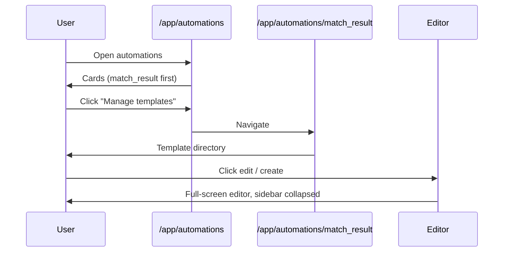

# Automations UI & navigation — implementation plan

> **Status:** Frontend plan (placeholder UI first, Convex wiring later)  
> **Related:** [Documentation/automations-and-templates.md](../Documentation/automations-and-templates.md) (approved backend/schema)  
> **Companion:** [template-editor-react-konva.md](./template-editor-react-konva.md) (editor deep-dive)

This document describes the **UI pages, routing, layout, i18n, and placeholder content** for the automations feature. It follows the navigation flow requested in product design and aligns with the approved Convex schema (`organizationAutomations`, `automationTemplates`, `templateAssets`).

---

## 1. Route map

| Route | Purpose | Layout |
|-------|---------|--------|
| `/app/automations` | Automation type overview (cards) | Standard app shell, `max-w-4xl` |
| `/app/automations/[automationType]` | Template directory for one type | Standard app shell, `max-w-4xl` |
| `/app/automations/[automationType]/[templateId]` | Template editor (react-konva) | **Full-width editor shell**, sidebar collapsed |

### Route params

```ts
type AutomationType = "match_result" | "match_announcement";
// Future: "starting_eleven"

// templateId values:
// - "new"  → create flow (preset picker → empty editor)
// - Id<"automationTemplates"> → edit existing
```

**Note:** The backend brief originally listed `/templates` and `/edit` suffixes. This plan uses the **shorter routes above** per product request. Update Convex query param names only; API paths stay the same.

### Priority order on `/app/automations`

1. **`match_result`** — top card, visually emphasized (primary automation).
2. **`match_announcement`** — second card.

---

## 2. Layout architecture

### 2.1 Problem

`AppShell` wraps all `/app/*` pages and constrains content to `max-w-4xl`:

```tsx
// components/app-shell.tsx
<main>
  <div className="mx-auto w-full max-w-4xl">{children}</div>
</main>
```

The template editor needs **nearly full viewport width** and the **sidebar collapsed by default**.

### 2.2 Solution: route group + controlled sidebar

Introduce a route group for the editor:

```text
app/app/
├── layout.tsx                    # existing auth gate + AppShell
├── automations/
│   ├── page.tsx                  # overview
│   ├── [automationType]/
│   │   ├── page.tsx              # template directory
│   │   └── [templateId]/
│   │       ├── layout.tsx        # editor layout override
│   │       └── page.tsx          # editor page (thin wrapper)
```

**Option A (recommended):** Add an optional `variant` prop to `AppShell`:

```tsx
type AppShellProps = {
  children: ReactNode;
  variant?: "default" | "editor";
};
```

When `variant="editor"`:

- Remove `max-w-4xl` wrapper (use `max-w-none`, `p-0` or minimal padding).
- Pass `defaultOpen={false}` to `SidebarProvider` (or control via `open` + `onOpenChange`).
- Editor page calls `useSidebar().setOpen(false)` on mount and restores previous state on unmount (read cookie / context before collapsing).

**Option B:** Nested layout that re-wraps only the editor segment. Harder because `AppShell` is in the parent layout; prefer Option A.

### 2.3 Sidebar auto-collapse

In `app/app/automations/[automationType]/[templateId]/layout.tsx` (client component):

```tsx
"use client";

import { useEffect, useRef } from "react";
import { useSidebar } from "@/components/ui/sidebar";

export default function TemplateEditorLayout({ children }: { children: React.ReactNode }) {
  const { setOpen, open } = useSidebar();
  const previousOpen = useRef(open);

  useEffect(() => {
    previousOpen.current = open;
    setOpen(false);
    return () => setOpen(previousOpen.current);
  }, [setOpen]); // intentionally omit `open` from deps to avoid fighting user toggles mid-session

  return <>{children}</>;
}
```

User can still expand the sidebar via `SidebarTrigger` or `Cmd/Ctrl+B`.

---

## 3. Page specifications

### 3.1 `/app/automations` — Automation overview

**Goal:** One full-width card per automation type. Each card is self-contained: settings at top, copy in middle, CTA at bottom.

**Wireframe (vertical card):**

```text
┌─────────────────────────────────────────────────────────────┐
│  [icon]  Match result                              [badge]  │
│  ─────────────────────────────────────────────────────────  │
│  Connected accounts                                         │
│    Facebook Page    ● Active                    [Switch ON] │
│    Instagram        ○ Not connected             [Switch OFF]│
│  ─────────────────────────────────────────────────────────  │
│  Title + description (from i18n)                            │
│  ─────────────────────────────────────────────────────────  │
│                              [ Manage templates → ]         │
└─────────────────────────────────────────────────────────────┘

(repeat for match_announcement — no primary styling)
```

**Components to create:**

| Component | Path | Responsibility |
|-----------|------|----------------|
| `AutomationTypeCard` | `components/automations/automation-type-card.tsx` | Full card layout |
| `SocialAccountRow` | `components/automations/social-account-row.tsx` | Platform icon, label, status badge, Switch |
| `AutomationOverviewPage` | inline in `page.tsx` | Maps types → cards |

**Mock data (Phase 1):**

```ts
const MOCK_SOCIAL_ACCOUNTS = [
  { platform: "facebook", connected: true, active: true },
  { platform: "instagram", connected: false, active: false },
] as const;
```

Switches toggle **local React state only** — no Convex calls until social OAuth exists.

**Visual priority for `match_result`:**

- Card appears first in DOM order.
- Optional: `ring-2 ring-primary/20` or subtle `border-primary/30`.
- Badge: `t("types.match_result.badge")` → e.g. "Most used" / "Meest gebruikt".

**Future wiring (Phase 2+):**

- `useQuery(api.automations.queries.listAutomations)` for `isEnabled` + template counts.
- Master enable toggle per automation type (maps to `setAutomationEnabled`).
- Template count in card footer: `t("templateCount", { count })`.

---

### 3.2 `/app/automations/[automationType]` — Template directory

**Goal:** List templates for one automation type. Primary CTA: create new template.

**Header:**

```text
← Back to automations          [ + Create new template ]
Match result templates
3 templates · Automation active (mock)
```

**Template list (table or card grid):**

| Column / element | Content |
|------------------|---------|
| Thumbnail | Placeholder gray box (future: `thumbnailStorageId`) |
| Name | Template name |
| Canvas preset | Badge: "1080×1080" etc. |
| Updated | Relative date (mock) |
| Actions | Edit (Pencil), Delete (Trash) icons |

**Empty state:**

- Illustration or icon + `t("templates.empty.title")` + CTA button.

**Navigation:**

- **Create:** `router.push(`/app/automations/${type}/new`)`
- **Edit:** `router.push(`/app/automations/${type}/${templateId}`)`
- **Delete:** `AlertDialog` confirm → toast (mock) → later `deleteTemplate` mutation

**Invalid `automationType`:** `notFound()` from `next/navigation`.

**Validation helper:**

```ts
// lib/automations/types.ts
export const AUTOMATION_TYPES = ["match_result", "match_announcement"] as const;
export function isAutomationType(v: string): v is AutomationType {
  return (AUTOMATION_TYPES as readonly string[]).includes(v);
}
```

---

### 3.3 `/app/automations/[automationType]/[templateId]` — Template editor

**Goal:** Full-screen react-konva editor. This page is a **thin route wrapper** only.

```tsx
// app/app/automations/[automationType]/[templateId]/page.tsx
"use client";

import dynamic from "next/dynamic";

const TemplateEditor = dynamic(
  () => import("@/components/template-editor/template-editor-root"),
  { ssr: false, loading: () => <TemplateEditorSkeleton /> },
);

export default function TemplateEditorPage({ params }: { params: { automationType: string; templateId: string } }) {
  return (
    <TemplateEditor
      automationType={params.automationType}
      templateId={params.templateId}
    />
  );
}
```

All editor logic lives under `components/template-editor/` — see [template-editor-react-konva.md](./template-editor-react-konva.md).

**Create flow (`templateId === "new"`):**

1. Show canvas preset picker modal (1080×1080, 1080×1350, 1200×630).
2. On confirm → create template via mutation (later) or local empty scene (Phase 1).
3. Replace URL with real id: `router.replace(...)` without full remount if possible.

---

## 4. File tree (frontend)

```text
app/app/automations/
├── page.tsx
└── [automationType]/
    ├── page.tsx
    └── [templateId]/
        ├── layout.tsx          # sidebar collapse
        └── page.tsx            # dynamic import wrapper

components/automations/
├── automation-type-card.tsx
├── social-account-row.tsx
├── template-list.tsx
├── template-list-item.tsx
├── create-template-button.tsx
└── delete-template-dialog.tsx

components/template-editor/
└── ...                         # see editor plan

lib/automations/
├── types.ts                    # AutomationType, guards
├── mock-data.ts                # placeholder templates, social accounts
└── canvas-presets.ts           # re-export from lib/template-scene when ready
```

---

## 5. Internationalization

Add keys under `app.automations` in **all four** locale files (`messages/nl.json`, `fr.json`, `en.json`, `de.json`).

### 5.1 Key structure

```json
{
  "app": {
    "automations": {
      "title": "Automatiseringen",
      "description": "Beheer je geautomatiseerde social media posts.",
      "backToOverview": "Terug naar automatiseringen",
      "manageTemplates": "Templates beheren",
      "connectedAccounts": "Gekoppelde accounts",
      "types": {
        "match_result": {
          "title": "Wedstrijdresultaat",
          "description": "Post automatisch een score-visual zodra het resultaat bekend is.",
          "badge": "Meest gebruikt"
        },
        "match_announcement": {
          "title": "Wedstrijdaankondiging",
          "description": "Post twee dagen voor de wedstrijd een aankondiging met tegenstander, datum en locatie."
        }
      },
      "social": {
        "facebook": "Facebook-pagina",
        "instagram": "Instagram",
        "active": "Actief",
        "inactive": "Inactief",
        "notConnected": "Niet gekoppeld"
      },
      "templates": {
        "title": "Templates voor {automationType}",
        "create": "Nieuw template",
        "empty": {
          "title": "Nog geen templates",
          "description": "Maak je eerste template om te beginnen met automatisch posten."
        },
        "edit": "Bewerken",
        "delete": "Verwijderen",
        "deleteConfirmTitle": "Template verwijderen?",
        "deleteConfirmDescription": "Dit kan niet ongedaan worden gemaakt.",
        "deleteSuccess": "Template verwijderd.",
        "deleteFailed": "Template verwijderen mislukt."
      },
      "editor": {
        "loading": "Editor laden…",
        "save": "Opslaan",
        "saveSuccess": "Template opgeslagen.",
        "saveFailed": "Opslaan mislukt."
      }
    }
  }
}
```

Use `useTranslations("app.automations")` consistently. Automation type titles/descriptions are **static i18n**, not loaded from Convex.

---

## 6. UI components to add (shadcn)

The project does not yet have a Switch component. Install before building account toggles:

```bash
pnpm dlx shadcn@latest add switch
```

Also useful for template directory:

```bash
pnpm dlx shadcn@latest add alert-dialog
```

Follow existing patterns from `components/ui/card.tsx`, `components/settings/OrganizationMembers.tsx` for spacing and typography.

---

## 7. Placeholder content strategy

| Surface | Phase 1 (UI only) | Phase 2 (Convex) |
|---------|-------------------|------------------|
| Automation enabled state | Hard-coded `true` | `organizationAutomations.isEnabled` |
| Template list | 2–3 mock items in `lib/automations/mock-data.ts` | `listTemplates` query |
| Social accounts | Mock rows, local switch state | Meta OAuth (deferred) |
| Template counts | Static numbers | Derived from query |
| Editor save | Console.log + success toast | `createTemplate` / `updateTemplate` |

Mock templates should use realistic Belgian club names for visual polish during demos.

---

## 8. User flows

### Flow A: Browse automations → manage templates



### Flow B: Toggle social account (mock)

1. User flips Instagram switch → local state updates, badge changes.
2. No toast required for mock toggles (avoid noise).
3. When real: persist per-platform preference on `organizationAutomations` or future `socialConnections` table.

---

## 9. Implementation phases

### Phase 1 — Static UI & navigation (this plan)

- [ ] Add `lib/automations/types.ts` + mock data
- [ ] Extend i18n keys (all 4 locales)
- [ ] Build `/app/automations` with two cards, mock social rows
- [ ] Build `/app/automations/[automationType]` with mock template list
- [ ] Add editor route with layout collapse + skeleton placeholder
- [ ] Add `Switch`, `AlertDialog` shadcn components
- [ ] Extend `AppShell` with `variant="editor"` (or equivalent)

### Phase 2 — Convex integration

- [ ] Wire `listAutomations`, `setAutomationEnabled`
- [ ] Wire `listTemplates`, `createTemplate`, `updateTemplate`, `deleteTemplate`
- [ ] Replace mocks with real data
- [ ] Sonner toasts on mutations per `.cursor/rules/user-feedback.mdc`

### Phase 3 — Editor (separate doc)

- [ ] Implement react-konva editor per [template-editor-react-konva.md](./template-editor-react-konva.md)
- [ ] Connect save/load to `sceneDocument`

---

## 10. Accessibility & UX notes

- Automation cards: use semantic `<article>` or `<section>` with heading hierarchy (`h2` per card).
- Social switches: associate `<Label>` with `Switch` via `htmlFor` / `id`.
- Template actions: icon buttons need `aria-label={t("templates.edit")}` etc.
- Back navigation: breadcrumb or explicit "Back to automations" link on template directory (don't rely on browser back only).
- Mobile: editor is desktop-first; show a friendly `md:hidden` message: "Use a laptop to edit templates" (optional Phase 1).

---

## 11. Alignment checklist with backend brief

| Backend concept | UI surface |
|-----------------|------------|
| `organizationAutomations.isEnabled` | Future master toggle on card (optional; social switches are separate) |
| `automationTemplates` | Template directory list |
| `canvasPreset` | Shown as badge; picked on create |
| `sceneDocument` | Loaded/saved in editor |
| `templateAssets` | Asset library in editor sidebar (Phase 3) |
| `bindingKey` / `assetId` | Property panel in editor |

---

## 12. Open questions (non-blocking)

1. **Master automation toggle on overview card** — Product mock shows per-social switches only. Add a card-level enable/disable switch now or wait for Phase 2?
2. **URL for create** — `.../new` vs generating Convex id server-side before navigation. Recommend `new` for simpler routing.
3. **Story format (1080×1920)** — Not in MVP canvas presets; add fourth preset when product confirms.
