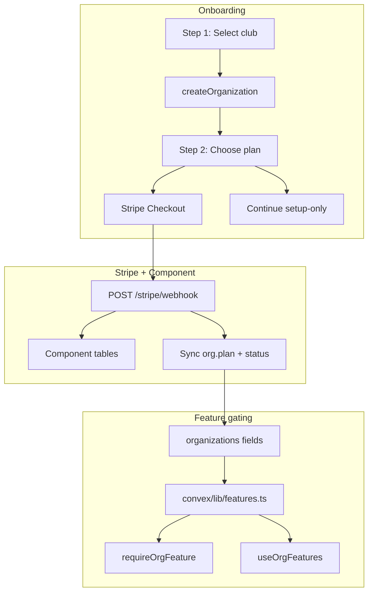

# Stripe billing with @convex-dev/stripe

## Install and documentation


| Item              | Value                                                                                                                          |
| ----------------- | ------------------------------------------------------------------------------------------------------------------------------ |
| **Install**       | `pnpm add @convex-dev/stripe`                                                                                                  |
| **Docs**          | [stripe.md](https://www.convex.dev/components/stripe/stripe.md), [llms.txt](https://www.convex.dev/components/stripe/llms.txt) |
| **GitHub / demo** | [get-convex/stripe](https://github.com/get-convex/stripe)                                                                      |
| **Version**       | 0.1.4 (Node 18+)                                                                                                               |
| **Branch**        | `feat/stripe-billing` (created)                                                                                                |


---

## Stripe products (sandbox — done by you)

Sandbox products in Yaru Dake (test mode):


| Tier     | Product name        | Price (excl. VAT) |
| -------- | ------------------- | ----------------- |
| Minimum  | Matchscore minimum  | €24/year          |
| Pro      | Matchscore pro      | €108/year         |
| Elite    | Matchscore elite    | €144/year         |
| Lifetime | Matchscore lifetime | €250 one-time     |


**Sandbox price IDs (test mode — committed in code, see catalog below):**


| Tier     | Price ID                         |
| -------- | -------------------------------- |
| Minimum  | `price_1Tl3QHLlL7dLpqB3FJmFBOln` |
| Pro      | `price_1Tl3QlLlL7dLpqB3Hvo9nhhk` |
| Elite    | `price_1Tl3RKLlL7dLpqB3RPwVZotu` |
| Lifetime | `price_1Tl3RjLlL7dLpqB3J2Yk4WCk` |


**Belgian VAT tax rate (sandbox):** `txr_1Tl3IZLlL7dLpqB3NsJp7EcD`

**Production:** Rename "Matchscore gold" → "Matchscore elite" in live Dashboard. Live price IDs go in the `live` section of the catalog file (same IDs if you only rename the product, not recreate prices).

**Customer portal:** configured by you in test mode (done).

---

## General feature gating design

Instead of ad-hoc `canUseGoalHighlights` booleans scattered across the codebase, use a **single feature registry** in `[convex/lib/features.ts](convex/lib/features.ts)` (your choice).

### Feature keys (extensible)

```typescript
export const Feature = {
  AutomationsEdit: "automations:edit",
  AutomationsPost: "automations:post", // future cron
  GoalHighlightsGenerate: "goal_highlights:generate",
  ApplyWatermark: "automations:watermark", // future render
} as const;
```

### Plan tiers

```typescript
export type PlanTier = "none" | "minimum" | "pro" | "elite" | "lifetime";
```

### Matrix (static, in code)


| Feature                    | none (setup-only) | minimum | pro | elite | lifetime |
| -------------------------- | ----------------- | ------- | --- | ----- | -------- |
| `automations:edit`         | yes               | yes     | yes | yes   | yes      |
| `automations:post`         | no                | yes     | yes | yes   | yes      |
| `goal_highlights:generate` | no                | no      | no  | yes   | yes      |
| `automations:watermark`    | no                | yes     | no  | no    | no       |


Requires `subscriptionStatus` in `active` or `trialing`. Lifetime ignores subscription status.

### API surface

```typescript
// Pure — unit-testable
export function resolvePlanTier(org: OrgBillingFields): PlanTier { ... }
export function hasFeature(tier: PlanTier, status: SubscriptionStatus, feature: Feature): boolean { ... }
export function getOrgFeatures(org: OrgBillingFields): Record<Feature, boolean> { ... }

// Server guard — used in mutations/actions
export async function requireOrgFeature(ctx, orgId, feature: Feature): Promise<void> { ... }
```

### Frontend hook

```typescript
// lib/billing/use-org-features.ts
const features = useQuery(api.billing.queries.getOrgFeatures);
if (!features?.[Feature.GoalHighlightsGenerate]) → show UpgradePrompt
```

**Principle:** Stripe/component tables = billing source of truth. `organizations.plan` + `subscriptionStatus` = denormalized cache for fast gating (synced via webhooks). Feature matrix lives only in `convex/lib/features.ts` — add new features by extending the enum + matrix row, not by editing every gate site.

### Routes (billing UI)

| Route | Status | Purpose |
| ----- | ------ | ------- |
| `/app/settings` | **Exists (Phase 1)** | Account settings; includes read-only `BillingSettings` (plan, status, feature flags, Stripe debug) |
| `/app/settings/plan` | **Phase 4** | In-app plan picker (same UX as onboarding plan step, inside app shell): current plan highlighted, upgrade CTAs, country/VAT, portal link for existing subscribers |
| `/app/settings/billing` | **Does not exist** | Do not link here — was a plan doc mistake |

**Phase 3 upgrade CTA** links to `/app/settings` (read-only billing summary) until `/app/settings/plan` ships in Phase 4.

---

## Feature access architecture (how gating works)

### Two layers — never confuse them

| Layer | Purpose | Data source | When it runs |
| ----- | ------- | ----------- | ------------ |
| **Client (UX)** | Hide/disable actions, show upgrade prompts, sidebar lock badges | Convex query → org billing fields | Page mount; stays subscribed |
| **Server (security)** | Block mutations/actions that cost money or compute | `ctx.db.get(organization)` + `hasFeature()` | Every gated write |

The client layer is for clarity; the server layer is authoritative. Never skip server guards because the UI looked disabled.

### What happens on page load (goal highlights example)

We do **not** call Stripe on every page load.

1. `useQuery(api.billing.queries.getOrgBillingContext)` (Phase 3 — consolidates features + plan/status for UX) runs once per app shell subscription.
2. Convex reads: auth user → membership (indexed) → organization document (by id).
3. Pure function `getOrgFeatureAccess({ plan, subscriptionStatus })` derives all feature booleans in memory (matrix is static TypeScript — no extra DB).
4. Result is **cached reactively**: Convex only re-runs the query when `organizations.plan` or `organizations.subscriptionStatus` change (webhook sync). Navigating between pages does not re-fetch from Stripe or re-scan tables if nothing changed.
5. Multiple components (sidebar, goal highlights page, settings) sharing the same query = **one WebSocket subscription**, deduplicated by the Convex client.

Typical cost: ~2 indexed DB reads + in-memory matrix lookup. Sub-millisecond at org scale.

### What happens on generate (server)

When `createOrOpenJob` runs:

1. `getCreateOrOpenPlan` already resolves membership + org context.
2. On the **create** branch only: `requireOrgFeature(org, Feature.GoalHighlightsGenerate)` — uses org fields already loaded or one `db.get`.
3. No Stripe API call. Webhooks keep org fields fresh; guards trust the denormalized cache.

`regenerateJob` is gated the same way. **Re-open existing jobs** and **view/download** stay allowed after downgrade.

### Why denormalized org fields (not live Stripe)

| Approach | Verdict |
| -------- | ------- |
| Stripe `subscriptions.retrieve` per action | Too slow, rate-limited, wrong tool for hot path |
| JWT/session feature claims | Stale until re-login; misses Convex reactivity |
| Component subscription table only | Extra join; org fields already synced by our webhooks |
| **`organizations.plan` + `subscriptionStatus`** | Fast, reactive, webhook-synced — **use this** |

Stripe remains source of truth for **billing**; org fields are a **cache** updated by webhooks (`syncOrganizationBilling`).

### Future features — same pattern

Adding a feature (e.g. `automations:post`):

1. Add key to `Feature` enum + row in matrix (`convex/lib/features.ts`) + unit test.
2. Add `requireOrgFeature(ctx, orgId, Feature.X)` at mutation/action entry points that perform the action.
3. Client: read from existing `getOrgBillingContext` / `useOrgFeatures()` — **no new query per feature**.
4. Optional: upgrade prompt component parameterized by `feature` + `blockReason`.

Do **not** create per-feature Convex queries or per-page Stripe lookups.

### Phase 3 query consolidation

`BillingSettings` currently calls both `getOrgBillingState` and `getOrgFeatures` (duplicate org read). Phase 3 introduces **`getOrgBillingContext`** returning `{ plan, subscriptionStatus, features, blockReason? }` for UI, while keeping `getOrgBillingState` for the settings debug panel (Stripe component subscription snapshot). App shell / sidebar / gated pages use the consolidated query only.

---

## Architecture




**Billing entity:** org-scoped (`orgId` in metadata). Any org member can manage billing.

---

## Webhook configuration (your questions answered)

### URL

Stripe sends webhooks **to Convex**, not from your app:

```
https://<your-deployment-name>.convex.site/stripe/webhook
```

Find `<deployment-name>` in [Convex Dashboard](https://dashboard.convex.dev) — it is the subdomain before `.convex.cloud` / `.convex.site` (e.g. if your URL is `https://happy-animal-123.convex.cloud`, use `happy-animal-123`).

Create **one endpoint per Convex deployment** (dev sandbox + production later). Each gets its own `whsec_...` → set as `STRIPE_WEBHOOK_SECRET` in that deployment's Convex env.

**Local testing alternative:**

```bash
stripe listen --forward-to https://<dev-deployment>.convex.site/stripe/webhook
```

Use the CLI's temporary signing secret as `STRIPE_WEBHOOK_SECRET` while developing.

### Events to subscribe

**Required for our integration** (no invoice UI, no invoice. handlers in our code):


| Event                           | Why                                         |
| ------------------------------- | ------------------------------------------- |
| `checkout.session.completed`    | Initial purchase + Lifetime; sync org plan  |
| `customer.created`              | Component customer sync                     |
| `customer.updated`              | Payment method / billing info changes       |
| `customer.subscription.created` | New subscription row                        |
| `customer.subscription.updated` | Plan changes via portal, renewals, past_due |
| `customer.subscription.deleted` | Cancellation                                |
| `payment_intent.succeeded`      | Lifetime one-time payment backup            |
| `payment_intent.payment_failed` | Failed Lifetime payment logging             |


**Skip these** (you don't want invoice handling):

- `invoice.created`, `invoice.finalized`, `invoice.updated`, `invoice.paid`, `invoice.payment_failed`

> **Note:** The component docs mention invoice events for populating component tables. We rely on `checkout.session.completed` + `customer.subscription.`* + `payment_intent.succeeded` for org sync instead. If component subscription rows are empty after checkout, add `invoice.paid` only — still no invoice UI in our app.

**Do not** IP-restrict the webhook endpoint to Convex IPs — Stripe sends from **Stripe's** IP ranges, not Convex.

---

## Stripe API key IP restrictions (your question)

There are two different directions:


| Direction                            | Who initiates       | IP restriction                                                            |
| ------------------------------------ | ------------------- | ------------------------------------------------------------------------- |
| **Convex → Stripe API** (secret key) | Your Convex actions | Optional: restrict secret key to Convex egress IPs                        |
| **Stripe → Convex webhook**          | Stripe              | Restrict to [Stripe webhook IPs](https://docs.stripe.com/ips), not Convex |


### Convex egress IPs (for secret key allowlist)

Convex has **no single fixed IP** — outbound traffic uses a **shared regional IP pool**.

If your Convex deployment is in **EU West (Ireland)**, allowlist these IPv4 addresses on the Stripe secret/restricted key ([Convex networking docs](https://docs.convex.dev/production/networking)):

```
3.248.173.188
34.242.144.108
54.170.181.63
54.195.47.143
54.73.189.39
63.33.186.66
```

**Recommendation:**

- **Test/sandbox:** leave IP restriction **off** — simpler debugging
- **Production:** either allowlist all 6 EU IPs above, **or** skip IP restriction and rely on key secrecy + webhook signing (Stripe recommends IP restriction but it's painful with serverless egress pools)

Check your deployment region in Convex Dashboard → Settings → confirm EU vs US and use the matching IP list from the docs.

---

## Customer Portal configuration

**Status: done (test mode)** — configured by you. Repeat in live mode before production cutover.

Reference (for live mode later):

Dashboard path: **Settings → Billing → Customer portal**  
Test mode: [dashboard.stripe.com/test/settings/billing/portal](https://dashboard.stripe.com/test/settings/billing/portal)

### 1. Activate portal

Click **Activate** (or **Configure**) if not already enabled.

### 2. Subscription management


| Setting                          | Value                                                                               |
| -------------------------------- | ----------------------------------------------------------------------------------- |
| **Switch plan**                  | **On**                                                                              |
| **Products to allow switching**  | Add all 3 subscription products: Minimum, Pro, Elite (each with their annual price) |
| **Update quantities**            | **Off** (not seat-based)                                                            |
| **Prorate subscription updates** | Your choice — **Off** is simplest for annual plans                                  |
| **Manage downgrades**            | **Update immediately** (default)                                                    |


### 3. Cancellation


| Setting                     | Value                                                    |
| --------------------------- | -------------------------------------------------------- |
| **Cancel subscription**     | **On**                                                   |
| **Cancellation reason**     | On (optional, useful feedback)                           |
| **Cancel at end of period** | **On** — matches "automations stop when not renewed" FAQ |


### 4. Payment methods


| Setting                    | Value  |
| -------------------------- | ------ |
| **Update payment methods** | **On** |


### 5. Invoice history — **Off / hidden**


| Setting             | Value                                                           |
| ------------------- | --------------------------------------------------------------- |
| **Invoice history** | **Disable** — you don't want invoice handling through Stripe UI |


Customers still receive Stripe email receipts; we just don't expose invoice list in portal or our app.

### 6. Business information

- Set business name, support email, privacy/terms links
- Add your **BE VAT number** under Settings → Business details → Tax IDs (for receipts)

### 7. Return URL

Set default return URL to: `{SITE_URL}/app/settings/plan`

Our code also passes `return_url` when creating portal sessions via `createCustomerPortalSession` (Phase 4).

### 8. Lifetime customers

Portal subscription switching doesn't apply to Lifetime (one-time). Lifetime orgs see plan info in our settings UI only; portal is for payment method if needed.

Repeat configuration in **live mode** before production cutover.

---

## Configuration: env vars vs code vs DB

### Decision: secrets in env, catalog in code


| Data                    | Where                                 | Why                                                                              |
| ----------------------- | ------------------------------------- | -------------------------------------------------------------------------------- |
| `STRIPE_SECRET_KEY`     | **Convex env**                        | Secret — must not be in git                                                      |
| `STRIPE_WEBHOOK_SECRET` | **Convex env**                        | Secret — must not be in git                                                      |
| `SITE_URL`              | **Convex env**                        | Already used; varies per deployment                                              |
| Price IDs               | `**convex/billing/stripeCatalog.ts`** | Not secrets (public in Checkout URLs); version-controlled; easy to review in PRs |
| Tax rate IDs            | **Same catalog file**                 | Not secrets; tied to Stripe Dashboard setup                                      |
| Plan → feature matrix   | `**convex/lib/features.ts`**          | Product logic, not infrastructure                                                |


**Why not env vars for price/tax IDs?** They are identifiers, not credentials. Putting them in env means duplicating 5 values per deployment with no security benefit and harder diffs when prices change.

**Why not DB?** Only 4 prices + 1 tax rate, changed rarely. A DB table adds seed migrations and admin UI for no gain at this scale. Revisit only if you need to change prices without deploys.

**Test vs live selection:** `getStripeCatalog()` picks `test` or `live` based on `STRIPE_SECRET_KEY` prefix (`sk_test_` → test, `sk_live_` → live). Same codebase, different Convex deployments — dev gets test keys, prod gets live keys, catalog switches automatically.

### Stripe catalog file

Create `[convex/billing/stripeCatalog.ts](convex/billing/stripeCatalog.ts)`:

```typescript
export type PlanTier = "minimum" | "pro" | "elite" | "lifetime";

export const stripeCatalog = {
  test: {
    prices: {
      minimum: "price_1Tl3QHLlL7dLpqB3FJmFBOln",
      pro: "price_1Tl3QlLlL7dLpqB3Hvo9nhhk",
      elite: "price_1Tl3RKLlL7dLpqB3RPwVZotu",
      lifetime: "price_1Tl3RjLlL7dLpqB3J2Yk4WCk",
    },
    taxRates: {
      beVat: "txr_1Tl3IZLlL7dLpqB3NsJp7EcD",
    },
  },
  live: {
    prices: {
      minimum: "price_1TjeEbLQXQ6hQ5Le6Kg8XISW",
      pro: "price_1TjeHdLQXQ6hQ5LeisqGSN1C",
      elite: "price_1Tl2mdLQXQ6hQ5LeHlgJ1fAY", // was "gold" product — rename in Dashboard
      lifetime: "price_1TjeJiLQXQ6hQ5LeS9n2Q8qD",
    },
    taxRates: {
      beVat: "txr_...", // create 21% BE rate in live mode before prod cutover
    },
  },
} as const;

export function getStripeCatalog() {
  const key = process.env.STRIPE_SECRET_KEY ?? "";
  return key.startsWith("sk_live_") ? stripeCatalog.live : stripeCatalog.test;
}

export function priceIdToTier(priceId: string): PlanTier | null { ... }
export function tierToPriceId(tier: PlanTier): string { ... }
```

`[convex/billing/helpers.ts](convex/billing/helpers.ts)` wraps catalog lookups + VAT logic (`billingCountry === "BE"` → apply `beVat` tax rate).

### Environment variables to add

**Convex Dashboard only** (2 new + 1 existing):


| Variable                | Required      | Example                 | Description                                             |
| ----------------------- | ------------- | ----------------------- | ------------------------------------------------------- |
| `STRIPE_SECRET_KEY`     | **Yes (new)** | `sk_test_...`           | Yaru Dake sandbox now; `sk_live_...` on prod deployment |
| `STRIPE_WEBHOOK_SECRET` | **Yes (new)** | `whsec_...`             | From Stripe webhook endpoint for this deployment        |
| `SITE_URL`              | Already set   | `http://localhost:3000` | Success/cancel/portal return URLs                       |


**Next.js:** no new vars. Hosted Checkout redirect — no publishable key in frontend.

Update `[.env.example](.env.example)` documenting the 2 new Convex secrets only.

---

## Implementation phases (4 — each with backend + frontend)

### Phase 1 — Foundation ✅ Done

**Goal:** Component installed, webhooks reachable, org billing fields exist, you can **see billing state in the frontend** before checkout exists.

**Implemented (2026-06-22):**

| Area | What shipped |
| ---- | ------------ |
| **Package** | `@convex-dev/stripe` 0.1.4 via pnpm |
| **Component** | Registered in `convex/convex.config.ts` alongside betterAuth, resend, r2 |
| **Webhooks** | `registerRoutes` at `/stripe/webhook` in `convex/http.ts` (Better Auth + VGF routes preserved) |
| **Schema** | `organizations.plan`, `subscriptionStatus`, `stripeCustomerId`, `billingSyncedAt` |
| **Catalog** | `convex/billing/stripeCatalog.ts` — sandbox + live price/tax IDs; auto-selects test/live from `sk_test_` / `sk_live_` |
| **Helpers** | `convex/billing/helpers.ts` — VAT logic (BE → 21%, else 0%) |
| **Features** | `convex/lib/features.ts` + `convex/lib/features.test.ts` — plan → feature matrix |
| **Queries** | `getOrgBillingState`, `getOrgFeatures` in `convex/billing/queries.ts` |
| **Settings UI** | `components/settings/BillingSettings.tsx` on Settings page — plan, status, feature flags, Stripe debug panel |
| **i18n** | Billing strings in en/nl/de/fr |
| **Env** | `.env.example` documents `STRIPE_SECRET_KEY` + `STRIPE_WEBHOOK_SECRET` (Convex only) |
| **Docs** | `Documentation/convex-structure.md` updated with `convex/billing/` layout |

**Backend (done):**

- [x] `pnpm add @convex-dev/stripe`
- [x] Register in `convex/convex.config.ts`
- [x] Merge `registerRoutes` into `convex/http.ts` (keep Better Auth + VGF routes)
- [x] Add org billing fields to `convex/schema.ts`: `plan`, `subscriptionStatus`, `stripeCustomerId`, `billingSyncedAt`
- [x] Create `convex/billing/queries.ts` → `getOrgBillingState`, `getOrgFeatures`
- [x] Create `convex/lib/features.ts` → feature registry + matrix (Elite not Gold)
- [x] Create `convex/billing/stripeCatalog.ts` → test/live price + tax rate IDs
- [x] Create `convex/billing/helpers.ts`, `validators.ts`, `types.ts`
- [x] Set Convex env vars: `STRIPE_SECRET_KEY`, `STRIPE_WEBHOOK_SECRET` (sandbox)
- [x] Configure webhook in Stripe test mode (`https://fine-wolf-59.convex.site/stripe/webhook`)

**Frontend (done):**

- [x] Billing section on `app/app/settings/page.tsx` via `BillingSettings`
- [x] Shows plan tier (`none` initially), subscription status, feature access, Stripe debug IDs
- [x] Disabled "Subscribe (Phase 2)" placeholder button

**Verified:**

- [x] `npx convex codegen` / deploy succeeds; `components.stripe` in generated API
- [x] Webhook test event → 200
- [x] Settings page loads billing query reactively for current org

**Deferred to Phase 4:** `/app/settings/plan` upgrade page, Customer Portal, landing pricing update.

---

### Phase 2 — Checkout + onboarding paywall ✅ Done

**Goal:** User completes onboarding → pays → org plan updates → settings UI reflects tier.

**Implemented (2026-06-22):**

| Area | What shipped |
| ---- | ------------ |
| **Checkout actions** | `createOrgSubscriptionCheckout`, `createOrgLifetimeCheckout` in `convex/billing/actions.ts` |
| **VAT** | BE → catalog `beVat` tax rate; other countries → no tax rate |
| **Webhooks** | `checkout.session.completed`, `customer.subscription.updated/deleted`, `payment_intent.succeeded` → `syncOrganizationBilling` |
| **Onboarding** | Two-step flow: club → `OnboardingPlanStep` (4 tiers, country selector, skip) |
| **Success UX** | Redirect `/app?checkout=success` + `CheckoutFeedback` toast + `skipBillingOnboarding`; middleware redirects stray `/?checkout=success` → `/app` |
| **Lifetime guard** | Blocks lifetime checkout while active subscription exists |

**Backend (done):**

- [x] `convex/billing/actions.ts` — subscription + lifetime checkout
- [x] `convex/billing/internalMutations.ts` — `syncOrganizationBilling`, `setStripeCustomerId`
- [x] `convex/billing/webhookHandlers.ts` + handlers in `convex/http.ts`
- [x] `convex/billing/internalQueries.ts` — `getCheckoutContext` (onboarding-only; intentional)
- [x] `convex/billing/mutations.ts` — `skipBillingOnboarding`
- [x] Membership required on checkout via `requireCurrentMembership` in internal query

**Frontend (done):**

- [x] `app/onboarding/page.tsx` — plan step when `needsBillingOnboarding`
- [x] `components/onboarding/OnboardingPlanStep.tsx`
- [x] `components/billing/CheckoutFeedback.tsx` in app shell
- [x] Checkout cancel toast on return to onboarding

**Deferred to Phase 4 (by design):**

- [ ] `/app/settings/plan` — in-app upgrade page (see Phase 4)
- [ ] Post-onboarding checkout / Customer Portal for plan changes

**Verify Phase 2:**

- [x] Sandbox checkout Minimum with test card `4242...`
- [x] Webhook fires → `organizations.plan = "minimum"`, settings UI updates live
- [x] BE checkout shows +21% VAT; non-BE shows base price only
- [x] Skip path → app works with `plan = none`, features = setup-only
- [x] After checkout, user lands on `/app` (not marketing homepage)

---

### Phase 3 — Feature gating end-to-end ✅ Done

**Goal:** Server enforces features; frontend shows clear upgrade prompts and sidebar lock state.

**Implemented (2026-06-22):**

| Area | What shipped |
| ---- | ------------ |
| **Server guard** | `requireOrgFeature` in `convex/billing/access.ts` |
| **Billing context query** | `getOrgBillingContext` — plan, status, features, `goalHighlightsBlockReason` |
| **Goal highlights gates** | Create blocked in `getCreateOrOpenPlan`; `regenerateJob` gated |
| **Errors** | Structured `feature_locked` with `upgrade_required` / `subscription_inactive` |
| **Hook** | `lib/billing/use-org-features.ts` |
| **Upgrade UI** | `UpgradePrompt` on goal highlights list + job detail; sidebar lock icon |
| **i18n** | Upgrade + error copy in en/nl/de/fr |
| **Watermark** | Stub comment in automations render (no runtime behavior) |

**Decisions (confirmed):**

- Upgrade CTA in Phase 3 → `/app/settings` (read-only billing summary; **not** `/app/settings/billing`)
- Full upgrade/plan picker → Phase 4 at `/app/settings/plan`
- Gate `regenerateJob` same as new generation
- After downgrade: view/download/re-open existing jobs OK; create + regenerate blocked
- Sidebar lock badge on goal highlights nav
- UX: distinguish **needs Elite** vs **subscription inactive** (`past_due`, `canceled`)

**Backend:**

- [x] `requireOrgFeature` in `convex/billing/access.ts` (loads org, calls pure `hasFeature` from `convex/lib/features.ts`)
- [x] `getOrgBillingContext` query — `{ plan, subscriptionStatus, features, blockReason }` for UI (avoids duplicate org reads)
- [x] Gate `getCreateOrOpenPlan` **create branch** → `Feature.GoalHighlightsGenerate`
- [x] Gate `regenerateJob` → same feature
- [x] Structured error `feature_locked` (+ `blockReason`: `upgrade_required` | `subscription_inactive`) for goal highlights
- [x] Stub comment in automations render for future `Feature.ApplyWatermark` (no runtime behavior)

**Frontend:**

- [x] `lib/billing/use-org-features.ts` — wraps `getOrgBillingContext`
- [x] `components/billing/UpgradePrompt.tsx` — reusable; tier-aware copy; CTA → `/app/settings` (interim)
- [x] `app/app/goal-highlights/page.tsx` — upgrade prompt replaces generate form when locked; history still visible
- [x] `app/app/goal-highlights/[jobId]/page.tsx` — disable regenerate with inline explanation when locked
- [x] `components/app-sidebar.tsx` — lock icon on goal highlights when feature missing
- [x] i18n: upgrade copy + `feature_locked` error in en/nl/de/fr

**Verify Phase 3:**

- Setup-only org → generate/regenerate blocked server-side + upgrade UI (mentions Elite)
- Minimum/Pro active → blocked with "Upgrade to Elite" messaging
- `past_due` / `canceled` → blocked with subscription-status messaging (not just "buy Elite")
- Elite/Lifetime → generate + regenerate work
- Downgraded org → existing jobs viewable; generate/regenerate blocked
- Sidebar shows lock when goal highlights unavailable

---

### Phase 4 — Plan page, portal, polish, production prep

**Goal:** Self-service plan changes via in-app plan page + Customer Portal; marketing alignment; production cutover.

**Backend:**

- [ ] Relax `getCheckoutContext` (or add `getUpgradeCheckoutContext`) so checkout works **after** onboarding — for orgs upgrading from `/app/settings/plan`
- [ ] `createCustomerPortalSession` action → portal URL with `return_url` to `/app/settings/plan`
- [ ] Ensure `customer.subscription.updated` webhook updates `organizations.plan` when user switches Minimum ↔ Pro ↔ Elite in portal

**Frontend — `/app/settings/plan` (primary upgrade surface):**

- [ ] New page at `[app/app/settings/plan/page.tsx](app/app/settings/plan/page.tsx)` inside app shell
- [ ] Reuse/refactor `[components/onboarding/OnboardingPlanStep.tsx](components/onboarding/OnboardingPlanStep.tsx)` into a shared plan picker component
- [ ] Show **current plan** clearly (badge/highlight on active tier)
- [ ] Upgrade CTAs per tier (checkout for new subscribers; portal for existing subscription changes)
- [ ] Country selector + VAT note (same as onboarding)
- [ ] Link from `UpgradePrompt`, settings nav, and optionally settings index
- [ ] Move upgrade CTA from `/app/settings` → `/app/settings/plan`

**Frontend — settings & marketing:**

- [ ] `/app/settings` — keep read-only `BillingSettings`; add link to **Manage plan** → `/app/settings/plan`
- [ ] Portal **"Manage billing"** on plan page for payment method / cancel / switch (existing subscribers)
- [ ] Update `[messages/en.json](messages/en.json)` + nl/de/fr: Minimum/Pro/**Elite**/Lifetime prices and FAQ (goal highlights = Elite/Lifetime only)
- [ ] Update `[components/landing/pricing/](components/landing/pricing/)` for 4 tiers (add Elite column/banner layout)
- [ ] Landing CTAs → `/sign-in`

**Verify Phase 4:**

- `/app/settings/plan` shows current plan; upgrade to Elite unlocks goal highlights
- Portal: upgrade Minimum → Elite → webhook updates plan → goal highlights unlocks without re-checkout
- Portal: cancel → `subscriptionStatus = canceled`, posting features blocked, editing still works
- Upgrade CTAs on goal highlights point to `/app/settings/plan`
- Rename production Gold → Elite in Stripe; add live `beVat` tax rate ID to catalog; configure live webhook + live secret key

---

## What to test today (Phases 1–3)

| Scenario | Expect |
| -------- | ------ |
| Onboarding skip | `/app` works; goal highlights locked |
| Onboarding checkout | Lands on **`/app`** after payment (not `/` marketing page); success toast |
| Elite/Lifetime org | Goal highlights generate + regenerate work; no sidebar lock |
| none / Minimum / Pro | Generate blocked; upgrade prompt; sidebar lock; history still viewable |
| `past_due` / `canceled` | “Restore billing” messaging (not just “buy Elite”) |
| Upgrade CTA | Goes to **`/app/settings`** (billing summary) — plan picker is Phase 4 |
| Settings | `/app/settings` shows plan, status, feature flags (read-only) |
| **Not yet** | `/app/settings/plan`, portal, post-onboarding checkout, landing pricing |

## Manual tasks for you

**Done (Phase 1):**

1. [x] **Convex env (dev):** `STRIPE_SECRET_KEY`, `STRIPE_WEBHOOK_SECRET`
2. [x] **Webhook endpoint** in test mode
3. [x] Sandbox products + prices
4. [x] Belgian VAT tax rate (sandbox)
5. [x] Customer portal (test mode)

**Before production cutover:**

1. **Rename production** "Matchscore gold" → "Matchscore elite" in live Stripe Dashboard
2. **Create live tax rate** (21% BE) → add ID to `stripeCatalog.live.taxRates.beVat`
3. **Live webhook** + `STRIPE_SECRET_KEY` / `STRIPE_WEBHOOK_SECRET` on prod Convex deployment
4. **Customer portal** repeat in live mode
5. **IP restriction (optional):** allowlist 6 EU West Convex IPs on live secret key, or leave unrestricted
6. **Lifetime + active subscription conflicts:** handle manually via support

---

## Key files

| File | Phase | Status | Purpose |
| ---- | ----- | ------ | ------- |
| `convex/convex.config.ts` | 1 | Done | Register stripe component |
| `convex/http.ts` | 1 | Done | Webhook route (org sync handlers in Phase 2) |
| `convex/schema.ts` | 1 | Done | Org billing fields |
| `convex/billing/stripeCatalog.ts` | 1 | Done | Test/live price + tax rate IDs |
| `convex/billing/helpers.ts` | 1 | Done | Catalog lookups, VAT logic |
| `convex/billing/queries.ts` | 1 | Done | Billing state + features query |
| `convex/billing/validators.ts` | 1 | Done | Shared validators |
| `convex/billing/types.ts` | 1 | Done | Plan tier types |
| `convex/lib/features.ts` | 1 | Done | Feature registry + matrix |
| `convex/lib/features.test.ts` | 1 | Done | Unit tests |
| `components/settings/BillingSettings.tsx` | 1 | Done | Settings debug UI |
| `.env.example` | 1 | Done | Stripe secret env var docs |
| `plans/stripe-plan.md` | — | Done | This plan |
| `convex/billing/actions.ts` | 2 | Done | Checkout (portal action in Phase 4) |
| `convex/billing/internalMutations.ts` | 2 | Done | Webhook → org sync |
| `convex/billing/webhookHandlers.ts` | 2 | Done | Stripe event → org patch |
| `app/onboarding/page.tsx` | 2 | Done | Two-step onboarding |
| `components/onboarding/OnboardingPlanStep.tsx` | 2 | Done | Plan selection + checkout |
| `components/billing/CheckoutFeedback.tsx` | 2 | Done | Post-checkout toast |
| `convex/billing/access.ts` | 3 | Done | `requireOrgFeature` server guard |
| `convex/billing/queries.ts` | 3 | Done | `getOrgBillingContext` |
| `convex/veoPosts/internalQueries.ts` | 3 | Done | Create-branch feature gate |
| `convex/veoPosts/actions.ts` | 3 | Done | Regenerate feature gate |
| `components/billing/UpgradePrompt.tsx` | 3 | Done | CTA → `/app/settings` (→ `/app/settings/plan` in Phase 4) |
| `lib/billing/use-org-features.ts` | 3 | Done | Client hook |
| `components/app-sidebar.tsx` | 3 | Done | Lock badge |
| `middleware.ts` | 2–3 | Done | Checkout success → `/app`; bypass onboarding redirect |
| `app/app/settings/plan/page.tsx` | 4 | Pending | In-app plan picker + upgrade |
| `components/landing/pricing/` | 4 | Pending | 4-tier marketing |
| `messages/*.json` | 3 | Done | Phase 3 upgrade copy; Phase 4 pricing FAQ |


---

## Risks and notes

- **http.ts merge:** Keep Better Auth + VGF routes; add Stripe alongside.
- **No invoice UI:** Stripe still generates payment receipts; we skip portal invoice history and don't query `listInvoices`* in our app.
- **Component invoice tables:** May stay empty without invoice webhooks — acceptable if org sync uses subscription/checkout events.
- **Shared Convex IPs:** Not unique to your deployment; don't use IP alone for auth.
- **Catalog auto-select:** Wrong key mode (test key + live price) causes Stripe API errors — caught immediately at checkout.
- **Live tax rate:** `stripeCatalog.live.taxRates.beVat` is placeholder until you create the live 21% rate in Dashboard.

